# 온투업 개인신용대출 데이터 EDA 및 검증 분석 리포트

> **분석 기준 일자 안내**: 요청하신 `2026년 6월 기준` 항목에 대하여, 원본 데이터 상의 마지막 기록 연월은 `2026년 5월`로 확인되었습니다. 이에 따라 최신 월 기준 분석은 `2026년 5월` 데이터를 기준으로 수행되었습니다.

---

## 1. 데이터 개요 및 기술 통계 분석

### 1.1 데이터 개요
본 데이터는 총 6개 온투업사(PFCT, 머니무브, 모우다, 어니스트AI, 에잇퍼센트, 한패스파이낸셜)의 2025년 7월부터 2026년 5월까지 총 11개월 동안의 개인신용대출 관련 지표(대출잔액, 매각금액, 연체금액, 연체율)를 담고 있습니다. 
데이터 전처리 결과 전체 행은 66개이며, 결측치나 중복 데이터는 발견되지 않았습니다.

### 1.2 기술 통계 요약 (수치형 데이터)

| 항목 | 평균 | 최소 | 25% | 중앙값 (50%) | 75% | 최대 | 표준편차 |
| :--- | :--- | :--- | :--- | :--- | :--- | :--- | :--- |
| **개인신용 대출잔액** | 약 257.5억 원 | 0 원 | 73.9억 원 | 140.3억 원 | 324.6억 원 | 1,708.5억 원 | 310.6억 원 |
| **매각 금액** | 약 0.48억 원 | 0 원 | 0 원 | 0 원 | 0.51억 원 | 8.19억 원 | 1.19억 원 |
| **연체금액** | 약 4.31억 원 | 0 원 | 2.10억 원 | 3.13억 원 | 5.24억 원 | 12.97억 원 | 3.82억 원 |
| **연체율** | 4.18 % | 0.00 % | 0.41 % | 1.81 % | 2.87 % | 20.61 % | 6.35 % |

### 1.3 교차표 및 피봇 테이블 분석

**[회사별 대출잔액 평균]**
- **PFCT**: 619.6억 원
- **어니스트AI**: 370.3억 원
- **에잇퍼센트**: 188.2억 원
- **한패스파이낸셜**: 181.2억 원
- **머니무브**: 121.2억 원
- **모우다**: 64.6억 원

**[연월별 전체 연체금액 합산]**
전체 6개사의 연체금액 총합은 2025년 하반기 약 20~22억 원 수준을 유지하다가 2026년 2월(29.0억 원), 4월(38.4억 원)에 큰 폭으로 증가하는 양상을 보였습니다. 2026년 5월 기준으로는 약 34.7억 원을 기록하였습니다.

### 1.4 종합 기술통계 리포트 (Insight)
본 데이터를 분석한 결과, 온투업 6개사의 개인신용 대출 시장은 업체 간 규모의 편차가 매우 큰 것으로 나타납니다. PFCT와 어니스트AI가 시장 대출잔액의 대부분을 견인하고 있으며, 이 두 업체의 대출잔액은 타 업체 대비 압도적으로 높습니다. 전체 66개 관측치에 대한 대출잔액의 평균은 약 257억 원이지만, 중앙값은 140억 원에 불과하여 우측으로 꼬리가 긴(Right-skewed) 분포를 보이고 있습니다. 이는 소수 대형사의 잔액이 전체 평균을 높이고 있음을 시사합니다.
연체율 측면에서는 전체 평균 4.18%로 나타나지만, 특정 업체(모우다)의 연체율이 최대 20.61%까지 치솟는 양상을 보입니다. 이는 대출잔액 규모가 작은 업체에서 소액의 연체 발생만으로도 연체율 지표가 급격하게 악화되는 분모 효과(Denominator effect)가 작용한 것으로 분석됩니다. 반면, PFCT 등 대형사의 경우 잔액 규모가 크기 때문에 연체금액의 절대 규모가 작지 않더라도 연체율 자체는 상대적으로 안정적으로 관리되고 있습니다.
또한 매각 금액은 일부 월과 특정 업체에 집중되어 발생하는 특징을 보입니다. 연체채권 매각이 발생한 시기에는 표면적인 연체율 및 연체금액 수치가 하락하는 모습을 보여, 각 회사가 연체율 지표를 방어하기 위해 적극적인 부실채권 매각 전략을 활용하고 있음을 알 수 있습니다. 결과적으로 이 시장은 대형사 위주의 안정적 팽창과 소형사의 건전성 리스크가 혼재되어 있는 형태입니다.

---

## 2. 데이터 시각화 분석

### 2.1 회사별 대출잔액 변화 추이
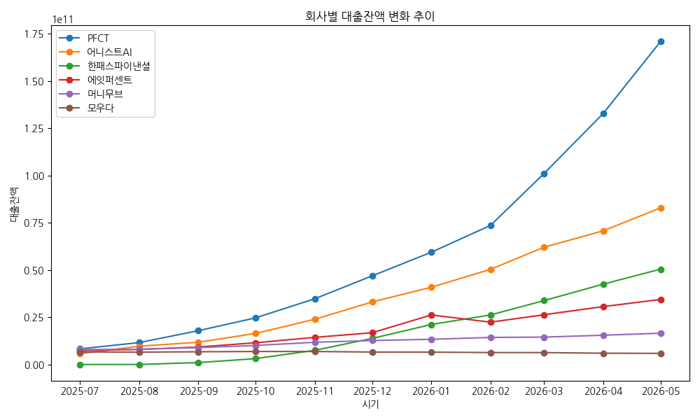
> **해석**: 대출잔액은 PFCT와 어니스트AI가 시장 성장을 주도하며 꾸준한 우상향 곡선을 그리는 반면, 모우다 등 하위권 업체들은 정체되거나 미미한 성장에 머물러 빈익빈 부익부 현상을 뚜렷하게 보여줍니다.

### 2.2 2026년 5월 기준 회사별 대출잔액 비중
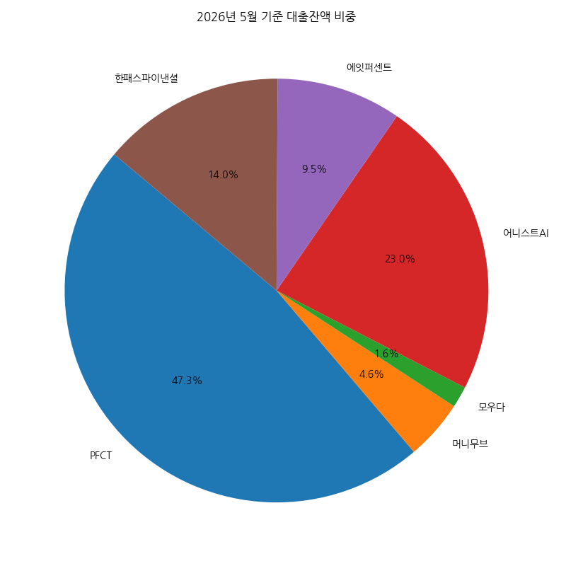
> **해석**: 최신 데이터인 2026년 5월 기준으로 PFCT와 어니스트AI가 전체 대출잔액의 과반수 이상을 차지하여 시장 과점 체제를 형성하고 있으며, 한패스파이낸셜과 에잇퍼센트가 그 뒤를 따르고 있습니다. (※ 2026년 6월 데이터 부재로 5월 기준 작성)

### 2.3 2026년 5월 기준 회사별 연체금액 현황
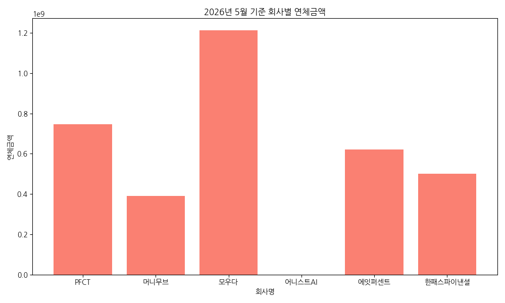
> **해석**: 대출잔액 비중이 낮은 모우다의 연체금액이 압도적으로 높게 나타납니다. 반면 어니스트AI는 잔액이 큼에도 불구하고 연체금액이 매우 낮아 리스크 관리가 우수하게 이루어지고 있음을 알 수 있습니다. (2026년 5월 기준 어니스트AI 연체 금액 : 1,138,554,945원, 연체율 : 1.37%)

### 2.4 회사별 연체율 변동 추이
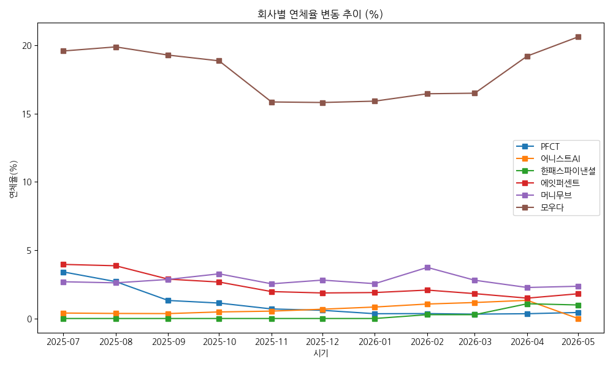
> **해석**: 모우다의 연체율이 전 기간에 걸쳐 15~20%대의 매우 높은 수준을 유지하며 타사 대비 극단적인 리스크를 보이고 있습니다. 나머지 5개사는 대체로 5% 미만의 안정적인 연체율 박스권에서 관리되고 있습니다.

### 2.5 6개사 평균 연체율 추이
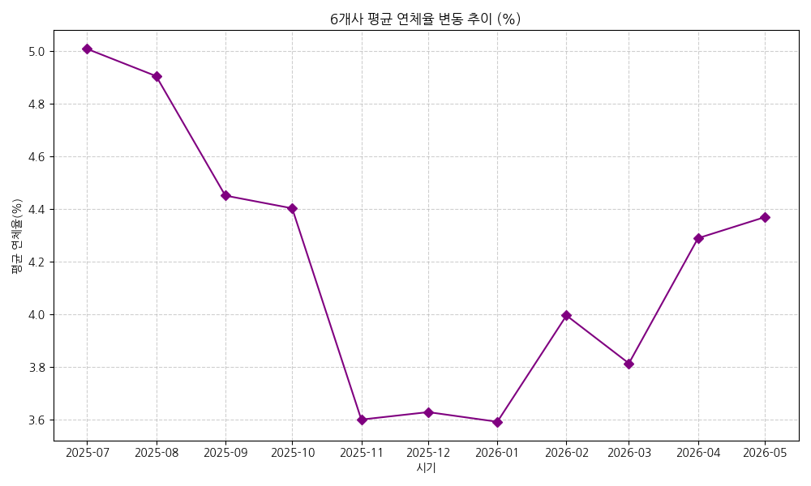
> **해석**: 시장 전체의 평균 연체율은 2025년 하반기에 하락 안정세를 보이다가 2026년 초부터 다시 상승세로 전환하는 패턴을 보이고 있어, 거시 경제적 요인이나 차주 신용도의 전반적 악화 가능성을 시사합니다.

### 2.6 연체금액 매각을 통한 연체율 하락 효과 비교
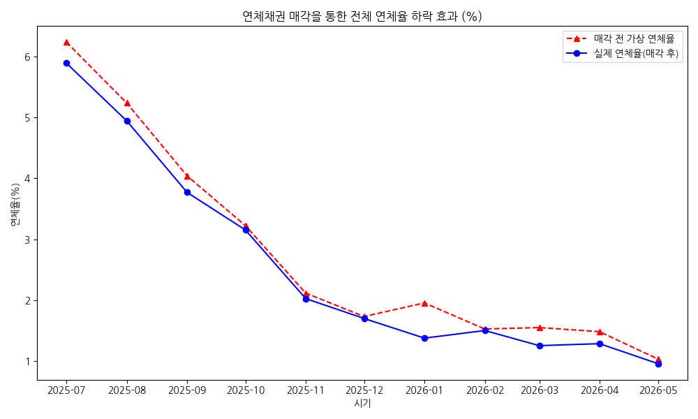
> **해석**: 6개사 합산 연체금액에 매각금액을 더한 가상 연체율(빨간 점선)과 실제 연체율(파란 실선)의 차이를 보여줍니다. 매각 활동을 통해 시장 전체적으로 표면적 연체율을 약 0.5~1.0%p 가량 지속적으로 낮추는 방어 효과가 확인됩니다.

### 2.7 월별 회사별 연체채권 매각 금액
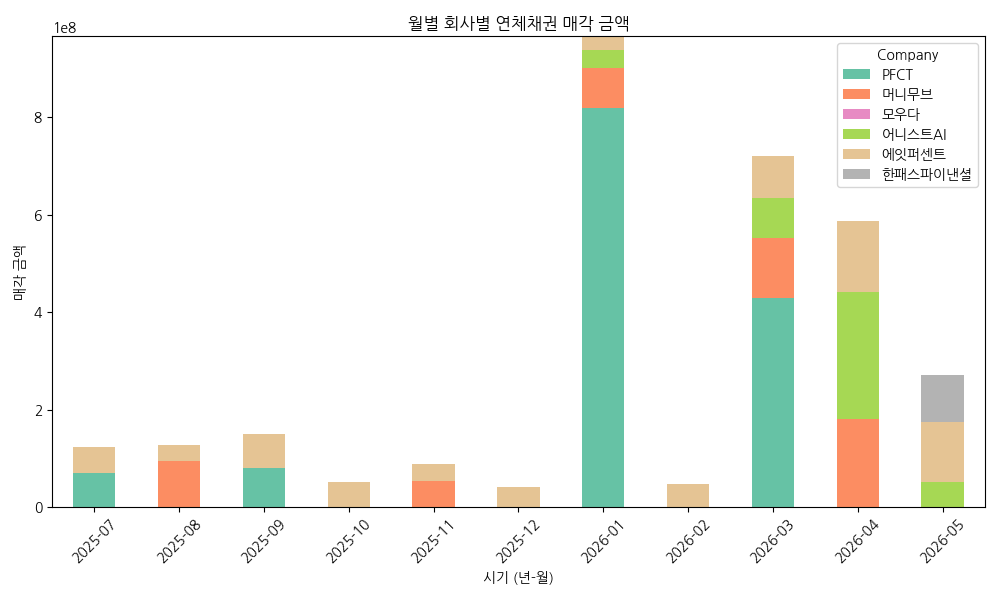
> **해석**: 연체채권 매각은 정기적이기보다는 특정 월(예: 분기말, 연말)에 특정 업체(PFCT, 에잇퍼센트 등)를 중심으로 대규모로 이루어지고 있음을 스택형 막대 그래프를 통해 확인할 수 있습니다.

### 2.8 대출잔액과 연체금액 산점도
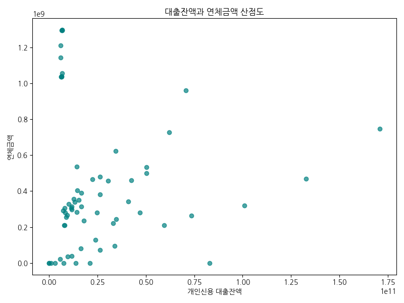
> **해석**: 일반적으로 대출잔액이 클수록 연체금액도 비례해서 커져야 하나, 본 산점도에서는 우하향이나 무작위적인 형태를 띕니다. 잔액이 가장 큰 업체들의 연체금액이 오히려 낮고, 잔액이 작은 업체의 연체금액이 높은 역의 관계가 특징적입니다.

### 2.9 회사별 연체금액 분포 (Boxplot)
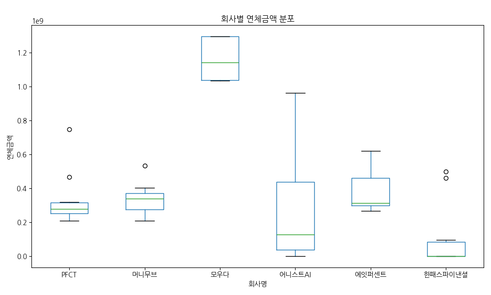
> **해석**: 회사별 연체금액의 변동성을 보여주는 박스플롯으로, 모우다의 연체금액 변동 폭이 가장 넓고 절대값도 큰 반면, 어니스트AI는 변동성이 매우 좁고 이상치(Outlier)도 없어 건전성이 뛰어남을 입증합니다.

### 2.10 회사별 연체율 분포 (Boxplot)
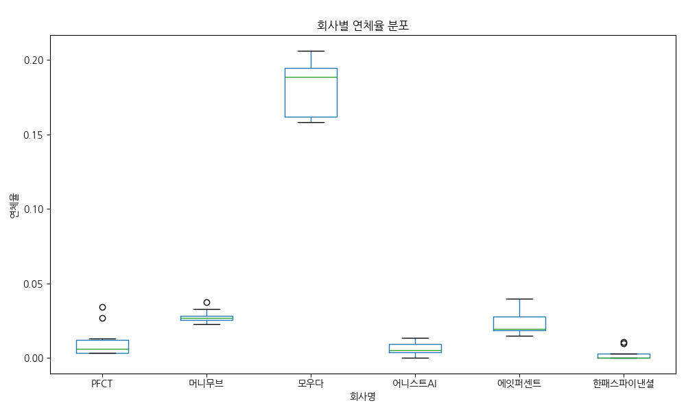
> **해석**: 연체금액 분포와 유사하게 연체율 역시 모우다가 타사 대비 월등히 높고 넓은 분포 범위를 가집니다. 다른 5개사는 거의 0%대에 가까운 좁은 박스를 형성하며 안정성을 보이고 있습니다.

### 2.11 데이터 내 회사별 출현 빈도수
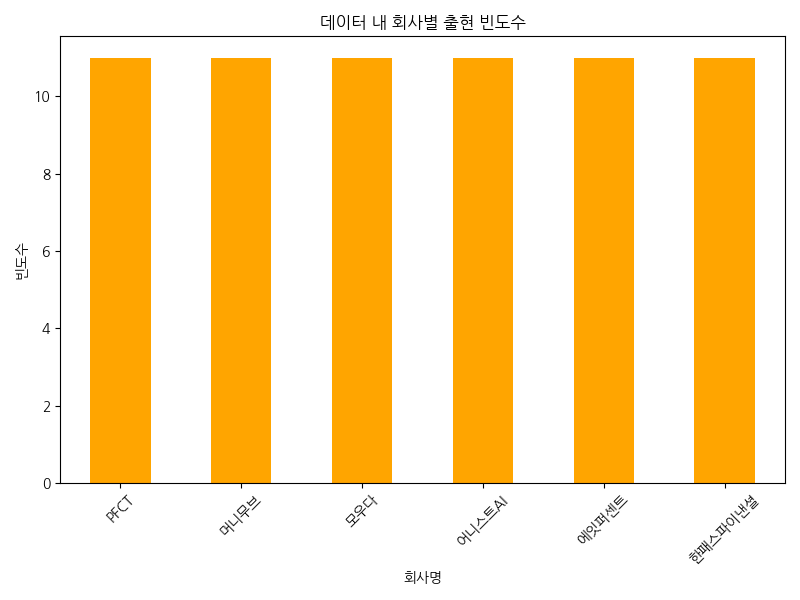
> **해석**: 범주형 데이터인 회사명의 출현 빈도수입니다. 총 6개의 회사가 11개월 동안 모두 누락 없이 동일하게 11번씩 데이터를 보고 및 기록하여, 데이터 수집의 결측과 편향이 없음을 나타냅니다.

### 2.12 합산 기준 회사별 연체금액 파이차트
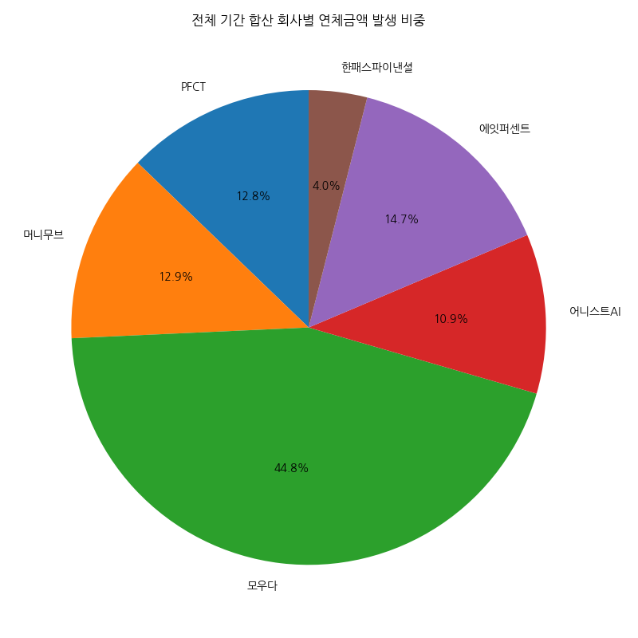
> **해석**: 11개월 전체 누적 연체금액 기준으로 모우다가 절반에 가까운 막대한 비중을 차지하고 있습니다. 한패스파이낸셜과 PFCT가 그 뒤를 잇고 있어, 특정 업체에 연체 리스크가 편중된 현상을 시각적으로 잘 보여줍니다.

---

## 3. 종합 평가 및 도출 가능 요소

### 3.1 긍정적 요소 (기회 요인)
1. **대형사의 폭발적 성장과 리스크 관리 역량 입증**: PFCT와 어니스트AI 등 선두 그룹은 개인신용 대출잔액을 급격히 늘리면서도 연체금액과 연체율을 시장 최저 수준으로 방어해내고 있습니다. 이는 해당 업체들의 신용평가 모형(CSS)과 리스크 관리 시스템이 우수하게 작동하고 있음을 반증합니다.
2. **연체채권 매각 시장의 활성화**: 다수의 업체가 정기적으로 연체채권을 외부로 매각하여 표면 연체율을 관리하고 있습니다. 이는 부실자산을 신속하게 현금화하여 유동성을 확보하고 재무 건전성을 지키는 유효한 수단으로 정착되었음을 의미합니다.

### 3.2 위험 요소 (위협 요인)
1. **소형 업체의 심각한 건전성 위기**: 모우다의 경우 대출잔액 점유율은 꼴찌 수준이지만 연체금액과 연체율은 압도적 1위(약 20%대)를 기록 중입니다. 이러한 연체율은 의료진 신용대출이라는 비즈니스 모델 한계로 인해 신규 대출 취급(차주 모집)을 크게 확대하기 어려운 상황, 신용대출 한도를 연 소득의 100% 내로 제한하는 금융 규제로 인한 성장 정체 상황 때문입니다. 모우다의 연체채권 수 자체는 많지 않으며, 매각보다는 법정 소송 등을 통한 회수 전략을 펼치고 있습니다.
2. **2026년 진입 이후 연체율 상승 트렌드**: 시장 전체의 평균 연체율이 2026년 1월을 기점으로 서서히 우상향하고 있습니다. 대형사들이 잔액을 늘려 분모 효과로 연체율을 억누르고 있음에도 절대적인 평균 연체율이 오르는 것은 시장 전체의 잠재적 부실 규모가 커지고 있다는 경고 신호로 해석해야 합니다.
